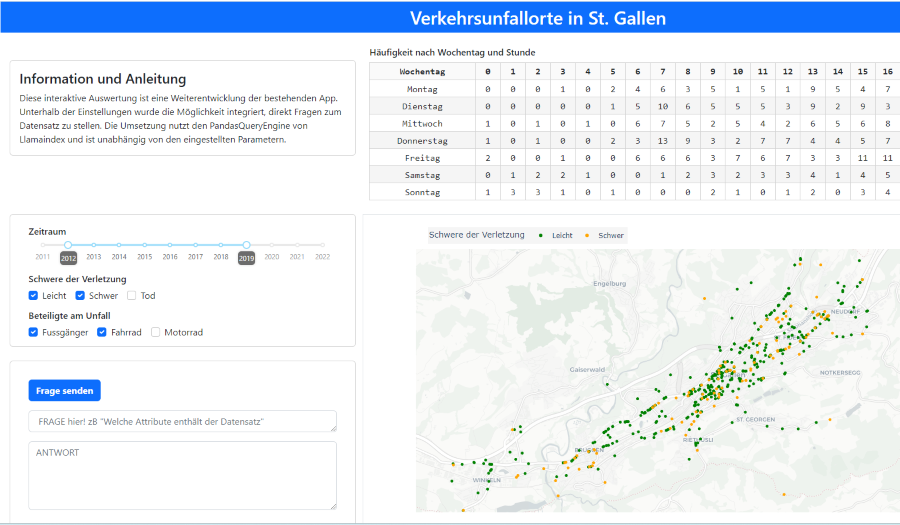

## Unfallorte in St. Gallen - Chatversion

### App

Diese App basiert auf dem "Open-Source-Framework" Dash und einem auf der Open-Data-Platform des Kantons St. Gallen verfügbaren Datensatz. Sie ist eine Erweiterung der bereits bestehenden App "Unfallorte in St. Gallen" um die Möglichkeit, 
in einem Chatfenster Fragen zum Datensatz zu stellen. Die Realisierung erfolgte mittels der PandaQueryEngine von LlamaIndex.

---

### Dash

> [Dash](https://plot.ly/products/dash/) is a productive Python framework for building web applications.
Written on top of Flask, Plotly.js, and React.js, Dash is ideal for building data visualization apps with highly custom user interfaces in pure Python. It's particularly suited for anyone who works with data in Python.

---

### Datensatz: Strassenverkehrsunfallorte
[Datenquelle](https://daten.sg.ch/explore/embed/dataset/strassenverkehrsunfallorte/table/?disjunctive.accidenttype_de&disjunctive.accidentseveritycategory_de&disjunctive.roadtype_de&disjunctive.cantoncode&disjunctive.municipalitycode&disjunctive.gem_name&disjunctive.accidentyear&disjunctive.accidentmonth_de&disjunctive.accidentweekday_de&disjunctive.accidenthour)

### Info des Herausgebers: (Bundesamt für Strassen)
Der Datensatz der Strassenverkehrsunfallorte beschreibt die anonymisierten, lokalisierten Einzeldaten von Strassenverkehrsunfällen. Verfügbar sind Angaben zur Art und Schwere des Unfalls, dem Unfallzeitpunkt und dem Ort und der Strassenart des Unfalls. Die Strassenverkehrsunfallorte sind ab dem Statistik Jahr 2011 schweizweit im vorliegenden Modell verfügbar.
